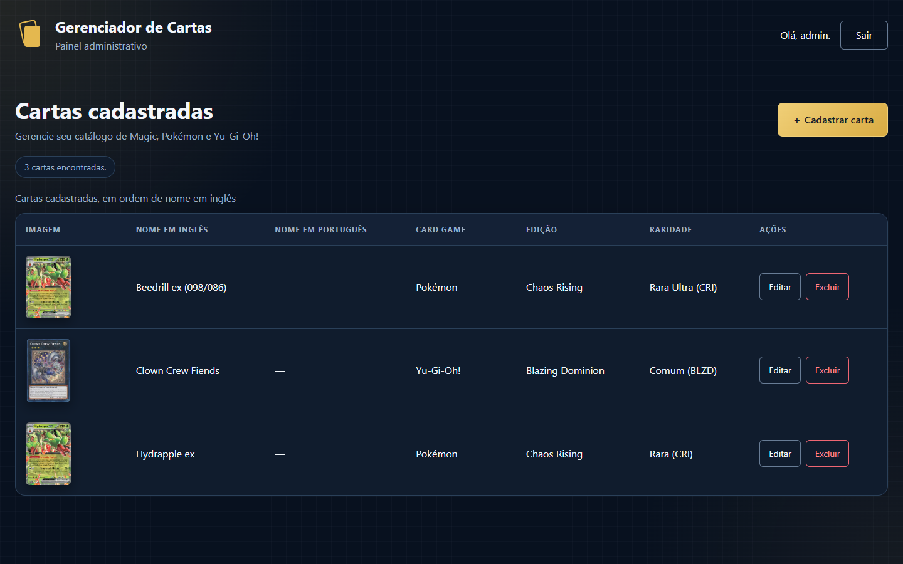
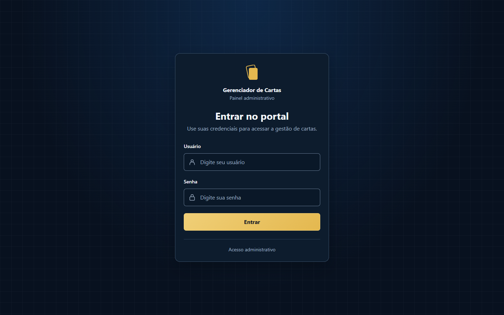
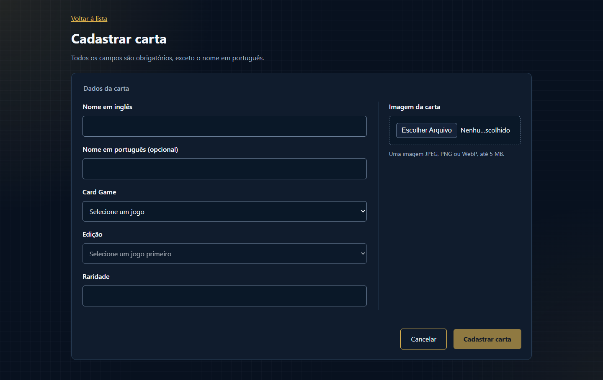

# Gerenciador de Cartas

Aplicação web para administrar um catálogo de cartas de **Magic: The Gathering**, **Pokémon** e **Yu-Gi-Oh!**. O projeto reúne autenticação, CRUD completo, upload de imagens e carregamento assíncrono de edições em uma interface responsiva.



## Funcionalidades

- Login e logout com sessão PHP.
- Listagem de cartas com jogo, edição, raridade e miniatura.
- Cadastro e edição com carregamento assíncrono das edições de cada jogo.
- Upload de imagens JPEG, PNG ou WebP, com prévia e limite de 5 MiB.
- Ampliação da imagem em modal acessível por mouse, toque ou teclado.
- Exclusão com confirmação e mensagens visuais de sucesso ou erro.
- Interface responsiva para desktop e dispositivos móveis.

## Interface

| Login | Cadastro de carta |
| --- | --- |
|  |  |

O tema usa CSS puro, sem framework visual. A listagem mantém o formato de tabela para facilitar a comparação entre registros, com rolagem horizontal em telas estreitas. O formulário organiza os campos e a imagem em duas colunas no desktop e em uma coluna no celular.

## Tecnologias

- PHP 8.4 e Apache
- MySQL 8.4
- PDO com prepared statements nativos
- HTML5, CSS3 e JavaScript Vanilla
- Docker e Docker Compose

O projeto não utiliza frameworks PHP, bibliotecas JavaScript, Composer ou gerenciador de pacotes no ambiente de execução.

## Arquitetura

```text
public/       páginas, APIs e arquivos estáticos expostos pelo Apache
src/          autenticação, acesso a dados, uploads e views compartilhadas
database/     schema relacional e dados iniciais de jogos e edições
scripts/      inicialização do banco e verificação do ambiente
docker/       configuração do Apache e do PHP
storage/      ponto de montagem das imagens enviadas
docs/         capturas de tela e documentação de testes
```

As páginas públicas tratam HTTP, autenticação e respostas. A lógica de cartas fica em `src/cards.php`, enquanto `src/database.php` centraliza a conexão PDO. O banco relaciona cada carta a uma edição, e cada edição ao seu card game, evitando duplicar o jogo na tabela de cartas.

## Executando localmente

### Requisitos

- Docker Desktop com containers Linux
- Docker Compose v2
- Porta `8080` disponível, ou outra porta definida em `APP_PORT`

Clone o repositório e acesse a pasta:

```sh
git clone https://github.com/FeBelluco/ligamagic-card-manager.git
cd ligamagic-card-manager
```

Inicie os serviços e prepare o banco:

```sh
docker compose up --build -d --wait
docker compose exec -T app php scripts/check-environment.php
docker compose exec -T app php scripts/init-database.php
```

Acesse [http://localhost:8080](http://localhost:8080).

Credenciais de demonstração:

```text
Usuário: admin
Senha: LigaDev2026!
```

Essas credenciais pertencem somente ao ambiente local. A senha é armazenada no banco como hash gerado por `password_hash`.

### Configuração opcional

O Compose possui valores padrão para desenvolvimento. Para personalizá-los, copie `.env.example` para `.env` e altere a porta e as senhas antes da primeira inicialização. O arquivo `.env` é ignorado pelo Git.

```sh
docker compose ps
docker compose logs --tail=50 app db
docker compose stop
docker compose start
```

`docker compose down` remove containers e rede, preservando os volumes. Não use `docker compose down -v` se quiser manter o banco e as imagens cadastradas.

## Decisões técnicas e de UX

- A edição permanece desabilitada até a escolha do jogo. As opções são buscadas por `fetch`, com estados de carregamento, erro e nova tentativa.
- Trocar o jogo cancela a requisição anterior e limpa a edição selecionada, evitando combinações inválidas.
- O backend confirma que a edição pertence ao jogo escolhido, mesmo que a validação do navegador seja contornada.
- Na edição, a imagem atual é mantida quando nenhum arquivo novo é enviado.
- A exclusão informa o nome da carta e começa com foco em **Cancelar**.
- Textos vindos do banco são inseridos no DOM com `textContent` e escapados quando renderizados pelo PHP.
- A raridade é apresentada com a sigla da edição em maiúsculas, como `Rara (HOB)`, sem alterar os valores armazenados.

## Segurança e imagens

- Sessões com cookies `HttpOnly`, `SameSite=Lax` e `Secure` quando há HTTPS.
- Renovação do ID da sessão após login.
- Tokens CSRF nas operações que alteram dados.
- Consultas parametrizadas com PDO e emulação de prepared statements desativada.
- Validação de tamanho, MIME real e conteúdo da imagem no servidor.
- Nomes de arquivo aleatórios e armazenamento fora da pasta pública.
- Endpoint autenticado para servir as imagens.

## Testes

Os fluxos principais foram verificados em navegador e por chamadas HTTP: autenticação, carregamento de edições, cadastro, listagem, edição, troca de imagem, exclusão, CSRF, arquivos inválidos e comportamento responsivo.

Os procedimentos e limites conhecidos estão documentados em [docs/testing.md](docs/testing.md).

## Limitações atuais

- A listagem carrega todas as cartas e ainda não possui paginação ou filtros.
- Não há limitação de tentativas de login; o projeto é voltado à demonstração local.
- Banco e sistema de arquivos não compartilham uma transação única. Uma interrupção abrupta pode deixar um arquivo órfão.
- A concorrência entre duas edições válidas usa a estratégia de última gravação.

## Próximos passos

- Adicionar paginação e busca.
- Criar testes automatizados versionados.
- Permitir configuração segura do usuário inicial fora do código.
- Adicionar limpeza administrativa de arquivos órfãos.
